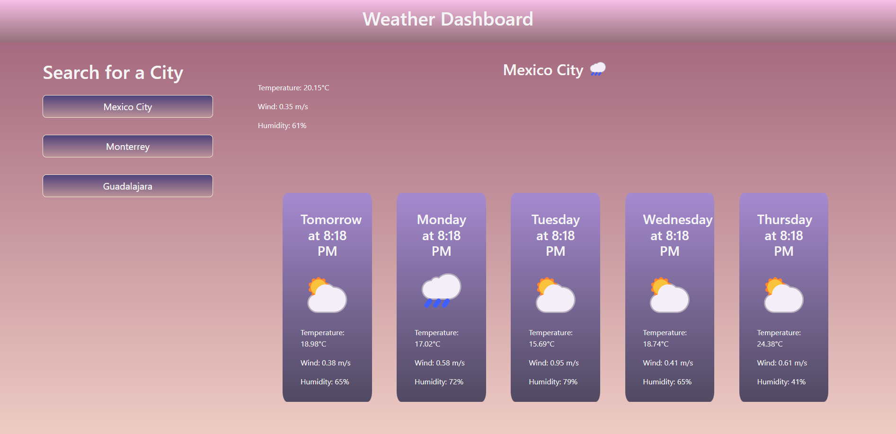

# 5 day Weather Forcast
## Challenge Module05  22/Oct/2022
### Último cambio: Mauricio García Hernández 22/Oct/2022

### User Story:
COMO UN viajero
QUIERO visualizar el pronóstico del clima para diferentes ciudades
PARA QUE pueda planear un viaje adecuadamente

### Criterios de aceptación:
CONSIDERANDO un tablero del clima con diferentes entradas
CUANDO busco una ciudad
ENTONCES se muestran las condiciones actuales y futuras para esa ciudad y esa ciudad se agrega al historial de búsqueda
CUANDO visualizo las condiciones actuales del clima para esa ciudad
ENTONCES se muestran el nombre de la ciudad, la fecha, un ícono que representa las condiciones del clima, la humedad, y la velocidad del viento
CUANDO visualizo las condiciones futuras del clima para esa ciudad
ENTONCES se muestra un pronóstico de 5 dias que muestra la fecha, un ícono que representa las condiciones del clima, la temperatura, la velocidad del viento, y la humedad 
CUANDO hago clic en una ciudad en el historial de búsqueda
ENTONCES se muestran de nuevo las condiciones presentes y futuras para esa ciudad

* Docs: https://openweathermap.org/forecast5#format
* Repositorio: https://github.com/maugh108/weather-forecast
* URL: https://maugh108.github.io/weather-forecast/